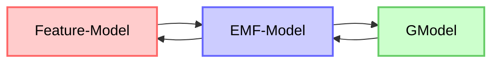
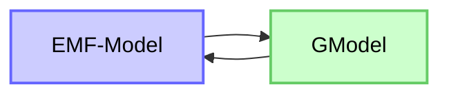
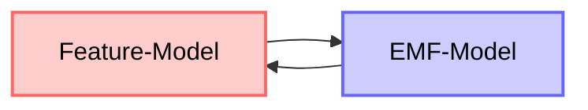

<div align="center">
  

  <br><br>

  <p align="center">
    <a href="#project-overview">Overview</a> •
    <a href="#building-the-project">Build</a> •
    <a href="#running-and-debugging-the-example">Run</a> •
    <a href="#architecture">Architecture</a> •
    <a href="#server-structure-and-classes-description">Server-Structure</a> •
    <a href="#client-and-customizations">Client Customizations</a> • </br>
    <a href="#multi-client-integration-support">Multi Client Integration</a> •
    <a href="#emf-model">EMF Model</a> •
    <a href="#translating-between-the-different-model-types">Model Transformation</a> •
</div>

<p align="center">
  <a href="https://github.com/AmjadAlwadi">
    
  </a>
  <a href="https://github.com/MohammadNayfHamsho">
    
  </a>
</p>


---


# GLSP Feature Modeler 

## Project Overview

**GLSP Feature Modeler** is a **team university project** aiming to design and implement a **GLSP-based diagram editor** using **Java / EMF**. The project focuses on:

- Creating, visualizing, and editing **feature nodes** (`featJAR.Feature`) in a **model-driven approach**.
- Ensuring **stable ID mapping**, **undo/redo support**, and proper **visual distinction** between **optional** and **obligatory** features.

</br>
</br>

`GLSP Feature Modeler` extends a GLSP Java/EMF server to manage and render `featJAR.Feature` elements as diagram nodes (GNodes). Users create nodes from the client; the server updates the EMF semantic and notation models and the GModel factory converts those models into shapes and labels the client renders. The implementation ensures stable IDs, undo/redo support, and visual distinction between optional and obligatory features.


`GLSP Feature Modeler` extends a GLSP Java/EMF server to manage and render `featJAR.Feature` elements as diagram nodes (GNodes).

The client translates a specific feature model (generated either programmatrically or parsed from a file) to another format EMF format, This source file is then sent to the server to be converted to a GModel, this GModel will then be sent back to the client to be rendered. 

<br>

<div align="center">

---


</div>

---
<br>

 Users can create/delete/modify feature-nodes/constraints from the client; the server updates the EMF semantic and notation models and the GModel factory on the server converts those models into shapes and labels which the client renders. The implementation ensures stable IDs, undo/redo support, and visual distinction between optional and obligatory features.

</br>

## **Building the Project**

To build the **GLSP** part of the project, run the following command in glsp-dependencies:

```
yarn build
```

To compile the entire project with the glsp-dependencies, we provide gradle support for that, run

```
./gradlew build
```

---
</br>


## **Running and Debugging the Example**

To test the **FeatureModel diagram editor**, a launch configuration for eclipse is already provided.  
In your Eclipse workspace, navigate to:  
`org.eclipse.glsp.example.javaemf.editor`

Then run or debug the example by right-clicking on **FeatureModelEditor.launch** and selecting:  
**Run As → FeatureModelEditor**

This will open a **second instance of Eclipse** with the GLSP FeatureModel editor plugins preinstalled.  
Import the provided example project into this workspace and open the `.FeatureModel` file to launch the diagram editor.


</br>


## **Architecture**

### Client 

- Sends **actions/operations** (`CreateNodeOperation`, `DeleteOperation`, etc.) to the server.
- Renders **GModel elements** (`GGraph`, `GNode`, `GLabel`) provided by the server.

### Server (GLSP Java / EMF)
- **EMF Model**: A structured representation that stores our data,encompassing both the semantic and notation models.
- **Operation Handlers** manage incoming operations and create/update EMF semantic and notation elements.
- **EditingDomain** and EMF `Command`s handle transactional updates.
- **EMFIdGenerator** ensures stable **semantic ↔ notation mapping**.

### Models

- **Semantic Model:** `featJAR.Feature` stores domain information (name, optional/root flags).  
- **Notation Model:** Diagram positions and sizes for rendering.  
- **GModel:** Client-facing graphical model generated by **GModel Factory**.


</br>


## **Server Structure and Classes Description**

### **Configuration: Diagram Editing Permissions**

**Purpose**  
In the Class **FeatureModelDiagramConfiguration**, defines what actions are allowed on nodes and edges in the feature model diagram, ensuring that users can only perform valid operations.

**What it does**  
- Specifies which elements can be **moved, deleted, resized, or reparented**.  
- Ensures that some elements (like root nodes) are fixed and cannot be resized or recreated.  
- Controls links: creation and deletion are allowed, reconnection is restricted.

</br>

---

</br>


### **Class: FeatureModelDiagramModule**

**Purpose**  
Connects all services, factories, and handlers for the feature model diagram, defining how elements are created, edited, and displayed.

**What it does**  
- Binds **diagram configuration**, **GModel factory**, **model storage**, and **ID generator**.  
- Registers **tool palette**, **label validator**, and **operation handlers** for creating and renaming nodes.  
- Defines the diagram type for GLSP (`FeatureModel-diagram`).

**Result**  
- Centralizes diagram setup and ensures consistent behavior for node creation, editing, and rendering.

</br>

---
### **Class: FeatureModelTypes**

**Purpose**  
Defines the mapping between EMF model elements and GModel types, ensuring the client can correctly render and handle each element.

**What it does**  
- Assigns **node types** for `ROOT`, `OPTIONAL_FEATURE`, and `OBLIGATORY_FEATURE`.  
- Assigns **edge types** for `CONSTRAINT` and `LINK`.  
- Ensures every GModel type is recognized and supported by the client for rendering and interaction.

**Result**  
- Provides a consistent reference for all semantic elements when converting them to GModel nodes and edges.  
- Guarantees that the client knows how to display and interact with each feature or connection type.

</br>

---
### **Class: FeatureTreeLayouter**

**Purpose**  
Provides an **automatic tree layout** for feature nodes, calculating positions for each node based on the tree structure.

**What it does**  
- Represents nodes as **TreeNode** objects, tracking children and coordinates.  
- Uses a **recursive layout algorithm** (`computePositions`) to calculate `x` and `y` positions for all nodes.  
- Maps between **TreeNode** instances and **GNode** objects used in the diagram.  
- Maintains a static list of all tree nodes for easy reference.  
- Provides utility methods to **clear layout** or retrieve nodes by ID.

**Result**  
- Ensures a clear hierarchical layout of feature nodes in the diagram.  
- Automatically positions internal and leaf nodes to produce an organized tree structure.  
- Supports mapping between semantic GModel nodes and layout nodes for rendering.

</br>

---
### **Creation Operation Handlers**

**Purpose**  
These handlers manage the **creation of nodes and edges** in the feature model diagram. They are triggered by client operations to add **features** (obligatory or optional) or **constraints** between features.  

**Handlers Included**  
- **CreateConstraintOperationHandler** – Creates new **constraint edges**.  
- **CreateObligatoryFeatureNodeHandler** – Creates new **obligatory feature nodes**.  
- **CreateOptionalFeatureNodeHandler** – Creates new **optional feature nodes**.  

**What They Do (Common Workflow)**  
1. Receive a **`CreateNodeOperation`** from the client.  
2. Determine the **parent element** in the EMF model:  
   - If a feature is selected, it becomes the parent.  
   - If no selection exists, the **root feature** or **feature model** is used as the parent.  
3. Create a new **EMF element** (Feature or Constraint) using the **FeatJARFactory**.  
4. Assign a **unique ID** to the new element using **EMFIdGenerator**.  
5. Build an **EMF `AddCommand`** to add the element to the parent in the semantic model.  
6. Wrap the command in a **`CompoundCommand`** to support transactional operations and **undo/redo**.  
7. Return the command to be executed by the **EditingDomain**.  


**Result**  
- Users can **create new features and constraints** in the diagram via the client.  
- Changes are immediately reflected in:  
  - **Semantic EMF model** (featJAR elements).  
  - **Graphical GModel** (nodes/edges in the client).  
- All creation operations support **undo/redo** and maintain **stable IDs**.

</br>

---
### **Delete Operation Handler**

**Purpose**  
The **DeleteFeatureNodeHandler** manages the **deletion of feature nodes** in the feature model diagram.  
It ensures that removed elements are deleted both from the **semantic EMF model** and the **graphical GModel**.

**What It Does**  
1. Receives a **`DeleteOperation`** from the client, containing a list of **GModel element IDs** to remove.  
2. Maps each GModel ID to the corresponding **EMF `Feature`** using `FeatureModelGModelFactory.featureIdMap`.  
3. Creates a **`RemoveCommand`** for each element:  
   - Removes the element from its **parent container** in the semantic model.  
   - Maintains EMF transactional integrity for undo/redo support.  
4. Combines all individual remove commands into a **`CompoundCommand`** for execution.  

</br>

---
**Utility**  
- **`findFeatureById(String id)`** – Searches the list of all EMF features (`FeatureModelGModelFactory.emfFeatures`) to locate a feature by its ID.  
- Handles cases where the feature list or ID is `null` gracefully.  

**Result**  
- Features selected for deletion are removed from the **EMF model** and subsequently from the **diagram** on the client.  
- Supports **undo/redo** via EMF transactional commands.  
- Ensures consistent mapping between semantic and graphical models after deletion.

</br>

---
### **Class: FeatureModelLabelEditValidator**

**Purpose**  
Handles **server-side validation** when a label of a diagram element is edited, ensuring correctness and uniqueness.

**What it does**  
- Validates that a label is **not empty**.  
- Checks for **duplicate labels** among other nodes and issues a warning if the name is already used.  
- Supports **direct editing** of node labels from the client, typically triggered by a double-click.  
- Currently, the **client-side operation** to initiate label editing is not fully implemented and requires a custom element for double-click editing.

**Result**  
- Ensures node labels remain meaningful and mostly unique.  
- Prevents empty names and informs users about potential conflicts.  
- Lays the foundation for safe client-side label editing once the corresponding client feature is implemented.

</br>

---
### **Class: Label Edit Validator**

**Purpose**  
Validates feature node labels to ensure they are not empty and mostly unique.

**What It Does**  
- **Empty check:** Returns an error if the label is empty.  
- **Duplicate check:** Warns if another node already has the same label.  
- **Default:** Returns OK if valid.

**Result**  
- Keeps labels meaningful and mostly unique.  
- Lays the foundation for safe direct editing from the client.

</br>

---
### **Paste Operation Handler(Incomplete)**

**Purpose**  
Handles **paste operations** for feature model constraints, allowing users to duplicate or insert new constraints from clipboard data.

**What It Does**  
- Reads the **last entry** from the clipboard data in the `PasteOperation`.  
- Creates a new **Constraint** instance using the clipboard value.  
- Adds the new constraint to the **FeatureModel** using an EMF `AddCommand`.  
- Wraps the command in a **CompoundCommand** for execution.  
- Assigns a **unique ID** to the new constraint using `EMFIdGenerator`.

**Result**  
- Enables **pasting constraints** into the EMF model safely.  
- Maintains consistency with existing model elements and generates unique identifiers.

</br>

---
### **Selection Action Handler**

**Purpose**  
Handles **selection actions** in the diagram, tracking which feature node is currently selected by the user.

**What It Does**  
- Checks if the incoming action is a **SelectAction**.  
- Retrieves the **selected element IDs** from the action.  
- Looks up the corresponding **Feature** in the model using `FeatureModelGModelFactory`.  
- Updates the **model state property** `"currentSelection"` with the selected feature.

**Result**  
- Maintains a reference to the **currently selected node** in the EMF model.  
- Enables other operations (e.g., create child nodes) to use the selected node as a **parent**.

</br>

---
### **FeatureModelToolPaletteItemProvider**

**Purpose**  
Defines and designs the **client-side tool palette**, allowing users to view information about elements and perform creation operations using custom icons.

**What it does**  
- Provides **node creation tools** for `Optional Feature`, `Obligatory Feature`, and `Constraint`.  
- Creates an **information legend** showing node and group types with labels and icons for quick reference.  
- Uses **custom icons** to visually distinguish element types in the palette.  
- Combines all palette items into **groups**: one for creating nodes, one for informational legend.  

**Result**  
- Users can easily **create new nodes** and understand the diagram elements at a glance.  
- The tool palette improves usability by showing both **actions** (create nodes) and **informational cues** (legend).  
- Supports consistent and intuitive interaction with the diagram editor.

</br>

---
### **Popup Model Factory(Incomplete)**

**Purpose**  
Generates **popup tooltips** for feature nodes to show contextual information.

**What It Does**  
- Creates HTML popups (`GHtmlRoot`) with labels (`GLabel`) for each node type.  
- Shows descriptions for root, obligatory, and optional features.  
- Applies CSS classes for styling (`glsp-tooltip`, `tooltip`).  

**Result**  
- Provides **informative tooltips** for feature nodes.  
- Fully integrated with the GLSP client for hover feedback.


</br>

---
### **FeatureModelGModelFactory**

**Purpose:**  
Converts the EMF semantic model (`featJAR.FeatureModel`) and notation model (`Diagram`) into a client-renderable GModel. Manages nodes, edges, labels, and constraint legends.

**Key Features:**
- Tracks all GModel elements (`GNode`, `GEdge`) and maps semantic IDs to graphical IDs.
- Creates nodes for root, optional, and obligatory features with proper CSS styling.
- Connects parent and child features with edges.
- Automatically lays out the feature tree using `FeatureTreeLayouter`.
- Creates a constraint legend box under the rightmost leaf, dynamically sized.
- Provides utilities for labels and separators in the constraints box.
- Clears previous elements and mappings for consistent redraws.

**Result:**  
Ensures a consistent and visually organized diagram, linking EMF features to graphical nodes, supporting auto-layout, ID stability, and constraint visualization.


</br>


## Client Customizations

### Custom Shapes
- Added **custom SVG shapes** for feature nodes.  
- **Size cannot be dynamic** because SVG uses absolute paths, so nodes do not scale automatically.  
- Custom shapes work visually.

### Icons and Images
- Tried to render **icons using SVG or image files**, but they did not appear correctly on the client.  
- Included asset paths via **Webpack**, but images were still not rendered.  
- Adding **custom icons** is difficult because the font bundle must be rebuilt and remapped, making it non-trivial.

### CSS Customizations
- Added **custom CSS classes** for each EMF class to improve visual styling.  
- This allows partial visual customization without modifying the core client code.  

### Summary
- **Custom shapes** are possible, but **resizing and dynamic rendering** are limited.  
- **Icons and images** are difficult to integrate due to client-side limitations.  
- **CSS classes** provide the easiest way to visually distinguish EMF elements.


</br>


## Multi-Client Integration Support

### Purpose
To provide support for multiple client environments in addition to **eclipse** e.g. **Theia**, **Visual Studio Code** using the same **GLSP server** code base enabling model editing and visualization across both platforms.

### What we did
- Set up and configured the **GLSP server** for communication with both clients.  
- Attempted to integrate **diagram rendering and operation handling** between the server and the two clients.  
- Adjusted connection settings and ports to enable proper synchronization.

### Problems Encountered
- The **Visual Studio Code integration** was difficult due to issues **finding and configuring the correct port**.  
- The **Theia client could not connect** because of internal **server configuration or startup issues**, preventing successful communication.  
- Overall integration was unstable, requiring more debugging on both server and client sides.

### Result
- Partial integration achieved, with communication working inconsistently.  
- Identified key issues related to **port configuration** and **server setup** that must be fixed for full client compatibility.  
- Gained better understanding of the **GLSP communication flow** between server and client environments.

</br>


## **EMF Model**

The **GLSP server** uses an **EMF model** that represents the **FeatJAR model**, currently in a simplified form.  
The model is located at:  
`FeatJAR/FeatJAR-gui/src/main/model`.

To modify the EMF model, it is **recommended to use Eclipse Modeling Tools**.  
You can import the project into Eclipse as an existing project.  
If the **class diagram** does not appear automatically, navigate to:  
`featJAR/model/featJAR.aird/Design/Entities in a Class Diagram/featJAR`  
and double-click on it to open.

Once the class diagram is open, you can generate the model code:  
1. Go to `featJAR/model/featJAR.genmodel`.  
2. Right-click on **FeatJAR** in the opened tab.  
3. Select **Generate Model Code**.


---

</br>


## **Translating between the Different Model Types**


### Converting between EMF model and GModel

<div align="center">


</div>

</br>


For each feature class in the EMF model, the server generates a corresponding GNode in the GModel, assigns it a unique identifier, parses its textual representation, and displays that on a GLabel. Based on specific attributes (e.g., obligatory, optional, root), the server applies distinct visual styles to the node.

For cross-tree constraints, the server creates a legend containing all defined constraints. Each constraint is represented by a dedicated GLabel, which the server arranges in a clear and visually separated manner.

The resulting GModel is fully interactive and modifiable. Users can create new feature nodes or constraints, delete existing nodes (which also removes their entire subtrees), remove cross-tree constraints, and edit the labels of individual nodes directly.


---
</br>


### Translating between EMF and FeatJAR Feature Models

<div align="center">


</div>


Under  
`FeatJAR-gui/src/main/java/de/featjar/gui/`,  
there are two main translator/parser classes:

- **TranslatorToEMF** – Converts a `FeatureModel` into `.featuremodel` and `.notation` files for the GLSP server/client to read.  
- **TranslatorFromEMF** – Reads a `.featuremodel` file and reconstructs a `FeatureModel`.

Additional details:  
- In `FeatJAR-gui/src/main/java/de/featjar/gui/EMFxmls/`, there is a `.uvl` file.  
- The `Gui.java` file creates a `.featuremodel` from this `.uvl` file along with other examples.  
- **Constraints** are not supported in the current version.  
- **Groups** are also not included but exist in another branch that supports them.
